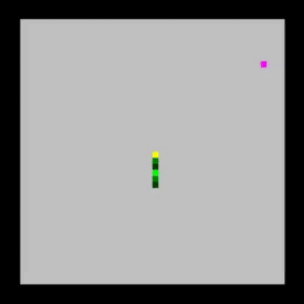

# Snake Game

## Introduction

This is a simple snake game built using C++ . This project uses "olc::PixelGameEngine" header file (Github_link:<a href="https://github.com/OneLoneCoder/olcPixelGameEngine"> olc::PixelGameEngine </a>). It is a simple snake game where you consume fruit and grow and try to avoid eating yourself"

**Note:** If you want to Clone this Repo make sure you have Visual Studio 2019 with C/C++ Development tools and you will be all set to open solution project and compile this for yourself.